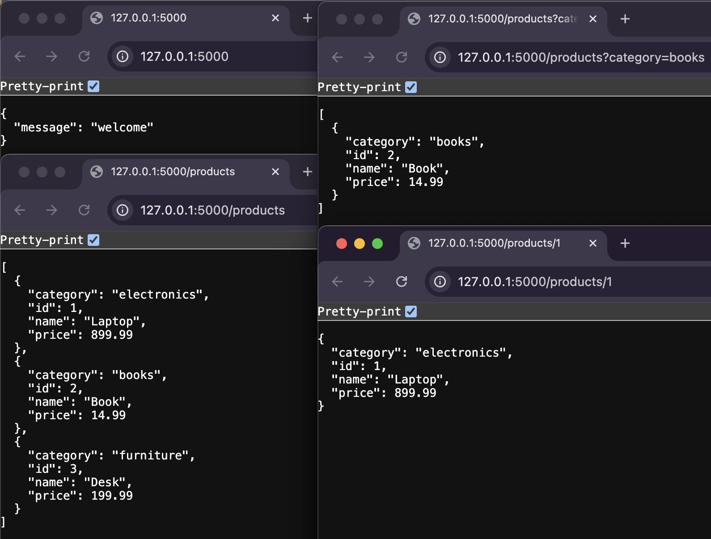

# Getting remote data lab

This project implements a simple read-only Flask API that serves a mock product catalog.

## Table of Contents
- [Demo](#demo)  
- [Setup](#setup)  
- [Testing](#testing)  
- [Features](#features)  
- [Usage](#usage)  
- [Endpoints](#endpoints)  

## Demo

---

## Setup
1. Fork & Clone the repo
2. Install dependencies: 
  `pipenv install`
  `pipenv shell`

---

## Testing
Run the existing test suite to validate functionality: `pytest`

---

## Features
- Homepage Route returns a welcome JSON message
- GET /products
	•	Returns the full product list
	•	Supports optional ?category=<name> filter
- GET /products/<id>
	•	Returns a single product by ID
	•	Returns a 404 JSON error if not found

---

## Usage

•	Run the server: 
  `python app.py`
•	Navigate in browser:
	  -  http://127.0.0.1:5000/
	  -  http://127.0.0.1:5000/products
	  -  http://127.0.0.1:5000/products?category=books
	  -  http://127.0.0.1:5000/products/1

---

## Endpoints

- Method: GET | Route: `/`| Welcome message
- Method: GET | Route: `/products` | All products (optional category filter)
- Method: GET | Route: `/products/<int:id>`| Single product by ID or 404 error